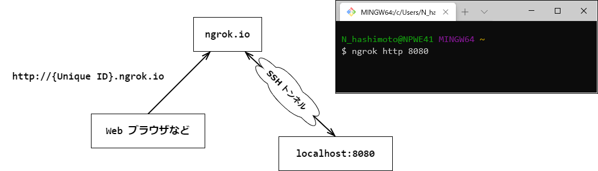

# ngrok の利用方法

## ngrokとは？
ngrok（エングロック）を使うと、Webhook を利用するための publicURL を発行できる。
簡易的にセキュアな URL をローカルホストサーバーに NAT や Firewall を通して構築することが可能となる。

## ngrok のメリット
1. デモサイトをデプロイせずに外部公開可能
2. 開発環境で webhook を動作確認できる
3. モバイルアプリのバックエンドサービスをテストできる
4. http だけではなく https 通信が可能

## ngrok でローカル開発サーバにアクセスできる仕組み
SSH ポートフォワーディングという技術を使って、ローカル開発サーバを外部に公開する。



## ngrokの使い方

### 実行環境
Windows 端末:  
Windows 10 Home 64bit バージョン 1909（OS ビルド 18363.1082）  
Scoop 2.2041.7
ngrok 2.3.35

### インストール
```console
scoop install ngrok
```

### 実行
ローカルの開発サーバを起動しておく。

ローカルサーバの例（API ドキュメント）:
```
http://localhost:8080/swagger-ui/index.html
```

ngrok コマンドを実行する。
```console
ngrok http 8080
```
実行例:
```
ngrok by @inconshreveable    (Ctrl+C to quit)

Session Status         online
Session Expires        7 hours, 18 minutes
Version                2.3.35
Region                 United States(us)
Web Interface          http://127.0.0.1:4040
Forwarding             http://{Unique ID}.ngrok.io -> http://localhost:8080
Forwarding             https://{Unique ID}.ngrok.io -> http://localhost:8080

Connections            ttl     opn     rt1     rt5     p50     p90
                       11      0       0.00    0.00    1.30    70.44

HTTP Requests
-------------

GET /v2/api-docs       200
```

### アクセス
httpの場合（例）:  
```
http://{Unique ID}.ngrok.io
```

https の場合
```
https://{Unique ID}.ngrok.io
```

## まとめ
ngrok を使うと簡単にローカル環境を http/https で外部公開できる。

webhookURL で本当に https 受信できるのか確認したりする時に便利。また、デモサイトを外部に一時的に見せる時にも利用できる。
